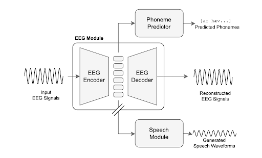

# Enhancing Listened Speech Decoding from EEG via Parallel Phoneme Sequence Prediction
### Jihwan Lee, Tiantian Feng, Aditya Kommineni, Sudarsana Kadiri, and Shrikanth Narayanan

### Code implementation for [paper](https://link-will-be-added "link will be added") accepted at ICASSP 2025

## Abstract
Brain-computer interfaces (BCI) offer numerous human-centered application possibilities, particularly affecting people with neurological disorders. Text or speech decoding from brain activities is a relevant domain that could augment the quality of life for people with impaired speech perception. We propose a novel approach to enhance listened speech decoding from electroencephalography (EEG) signals by utilizing an auxiliary phoneme predictor that simultaneously decodes textual phoneme sequences. The proposed model architecture consists of three main parts: EEG module, speech module, and phoneme predictor. The EEG module learns to properly represent EEG signals into EEG embeddings. The speech module generates speech waveforms from the EEG embeddings. The phoneme predictor outputs the decoded phoneme sequences in text modality. Our proposed approach allows users to obtain decoded listened speech from EEG signals in both modalities (speech waveforms and textual phoneme sequences) simultaneously, eliminating the need for a concatenated sequential pipeline for each modality. The proposed approach also outperforms previous methods in both modalities. The source code and speech samples are publicly available.




## Environment
- Recommended: `Python >=3.8`
- Install required python packages. 
    - Refer to `requirements.txt`
    - e.g.) `pip install -r requirements.txt`


## Training Example
```sh
python3 train.py -c configs/config.json -m <run_name>
```

## Sample Page
You can find some speech samples [here](https://lee-jhwn.github.io/icassp25-fesde-phoneme/ "speech samples").


## References
#### We adopt some of the backbone code from the following repos:
- https://github.com/lee-jhwn/fesde
- https://github.com/jaywalnut310/vits 
- https://github.com/Uncertain-Quark/s4_eeg
- https://github.com/openspeech-team/openspeech
